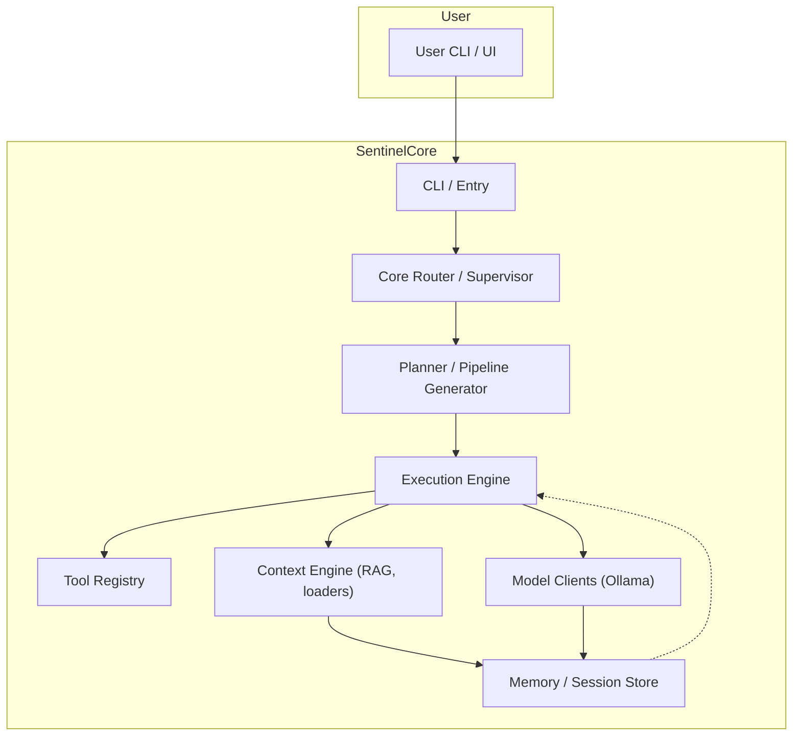
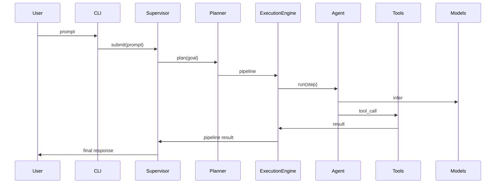

# Architecture Overview

This document describes the architecture of the Local-LLM-Coding-Assistant ("Sentinel"). It is written for contributors, maintainers, and integrators who need a detailed understanding of component responsibilities, data flows, runtime modes, and extension points.

## Table of contents

- [High-level summary](#high-level-summary)
- [Component details](#component-details)
- [Data flows and lifecycle](#data-flows-and-lifecycle)
- [Runtime modes](#runtime-modes)
- [Extension points](#extension-points)
- [Where to look in code](#where-to-look-in-code)

## High-level summary

Sentinel is structured as a modular, pipeline-oriented orchestration system for local LLM-based developer tooling. The system separates concerns into the following major subsystems:

- CLI / entrypoint
- Core services (routing, model routing, execution engine)
- Agents (specialized actors such as `coding_agent`, `research_agent`)
- Execution pipeline (dynamic, JSON-serialisable pipelines of steps)
- Context engine (RAG, symbol graphs, file loaders)
- Models (Ollama client and external model adapters)
- Memory (conversation/session store and project indices)
- Tools (encapsulated side-effectful operations)

## Component details

### CLI / Entry
- `main.py` exposes the `sentinel` console script. CLI parsing and bootstrapping live here.
- Responsibilities: parse args, determine project directory, set logging and telemetry, perform bootstrap checks.

### Core Router & Supervisor
- Handles incoming prompts and dispatches to appropriate agents.
- Implements retry/fallback policies and high-level orchestration.

### Agents
- Agents are purpose-built actors with a common `BaseAgent` interface. Key agents:
  - `CodingAgent`: code generation, patching files, refactors
  - `DebuggingAgent`: reproduce failures, propose fixes
  - `ResearchAgent`: external lookups and evidence gathering
  - `SystemAgent`: OS operations, dependency installation
  - `CriticAgent`: review and approval pass for important edits

Agents accept `PipelineStep` objects and produce `AgentAction` outputs (tool calls, file edits, or responses).

### Execution Engine
- Converts a pipeline into ordered step execution, respecting dependencies and concurrency budgets.
- For each step: build context, select model, invoke agent, apply resulting actions, record metrics.

### Context Engine
- Responsible for assembling compact, token-aware contexts for steps using RAG search, symbol graphs, and file excerpting.
- Provides ranking heuristics and token-budget enforcement.

### Model Clients
- Primary local model integration is via Ollama HTTP client (see `models/ollama_client.py`).
- A model registry maps logical model roles (e.g., `coding`, `reasoning`, `embed`) to concrete tags installed on the host.

### Tools
- Tools encapsulate side effects with schema-driven inputs (e.g., `read_file`, `write_file`, `run_shell`).
- Tool invocations are validated, timed, and audited.

### Memory
- `memory/session_store.py` and `memory/conversation_memory.py` persist sessions and maintain an in-memory working buffer.

## Data flows and lifecycle

## Runtime modes

- `minimal`: constrained token budgets, smallest recommended models. (8–12 GB RAM)
- `standard`: balanced tradeoff. (12–20 GB RAM)
- `advanced`: high-capacity models and concurrency. (≥20 GB RAM or GPU)

Hardware detection and recommended model selections are implemented in `system/hardware_detector.py` and `config/hardware_profile.py`.

## Extension points

- Add new `Tool` classes under `tools/` and register them in the tool registry.
- Add new `Agent` subclasses under `agents/` and wire them into planner heuristics.
- Implement new model adapters under `models/` for additional runtimes.

## Where to look in code
- `main.py` — startup and CLI
- `agents/` — agent implementations
- `core/` — supervisor, model router, execution engine
- `execution/` — pipeline types and step runner
- `context/` — RAG, loaders, symbol graph
- `models/` — model clients and registry
- `tools/` — all side-effectful operations

## Key files and classes (developer map)

This quick index helps contributors find the primary implementation points referenced in docs and tests:

- `main.py` — application entrypoint; parses CLI flags and invokes bootstrap.
- `agents/base_agent.py` — `BaseAgent` interface and common utilities.
- `agents/coding_agent.py` — `CodingAgent` implementation for code edits and generation.
- `agents/debugging_agent.py` — `DebuggingAgent` for test repro and patch proposals.
- `core/execution_engine.py` — `ConcreteExecutionEngine` that drives `Pipeline` runs.
- `core/model_router.py` — model selection heuristics (fallbacks, profiles).
- `execution/pipeline.py` — `Pipeline` and `PipelineStep` types, JSON serialization.
- `context/context_builder.py` — constructs per-step contexts from RAG, symbol graphs, and files.
- `models/ollama_client.py` — HTTP client wrapper used to call local Ollama instances.
- `memory/session_store.py` — session lifecycle and persistence.
- `tools/` (many files) — `read_file`, `write_file`, `git_commit`, `run_shell`, etc.

Consult these files when implementing features or debugging behavior; unit tests under `tests/` reference these modules directly.

---

This file is intentionally comprehensive; for API-level details consult the package-level docstrings and the tests under `tests/`.
