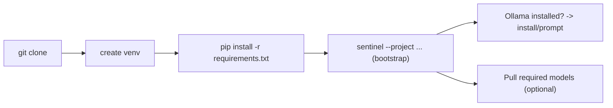

# Installation Guide

This guide covers full installation and bootstrap of Sentinel on Windows, Linux, and macOS. It includes offline preparation, Ollama model management, environment configuration, and troubleshooting steps.

## Table of Contents

1. Prerequisites
2. Standard installation and bootstrap
3. Windows quick start (detailed)
4. Linux / macOS quick start (detailed)
5. Ollama setup and model management
6. Environment variables and configuration
7. Offline / air-gapped installation
8. GPU specifics (NVIDIA / AMD / Apple)
9. Troubleshooting and diagnostics

## Interactive features

This file includes interactive-friendly Markdown patterns:

- Task lists: use the checkboxes to track progress when following the guide.
- Collapsible advanced sections: expand `<details>` blocks for advanced or platform-specific instructions.
- Mermaid diagrams: architecture and bootstrap flows use fenced mermaid blocks.

Example quick checklist:

- [ ] Clone repository
- [ ] Create and activate virtualenv
- [ ] Install dependencies
- [ ] Run `sentinel --project` bootstrap

---

## 1. Prerequisites

Software:

- Python 3.11+ (3.12/3.13 supported)
- Git (recommended)
- Ollama (local model runtime)

Hardware:

- Minimum: 8 GB RAM (minimal mode)
- Recommended: 16 GB+ for comfortable operation
- GPU: optional; improves performance for large models

Network:

- Online mode: network access required for initial bootstrapping and pulling models
- Offline mode: supported via pre-downloaded Ollama models and wheel packages

---

## 2. Standard installation and bootstrap

1. Clone and enter repository:

```bash
git clone https://github.com/your-org/Local-LLM-Coding-Assistant.git
cd Local-LLM-Coding-Assistant
```

2. Create and activate a virtual environment:

```bash
python -m venv .venv
source .venv/bin/activate    # macOS / Linux
.venv\Scripts\Activate.ps1  # Windows PowerShell
```

3. Install Python dependencies:

```bash
pip install -r requirements.txt
```

4. Run the bootstrap (first run):

```bash
sentinel --project /path/to/your/project
```

During bootstrap Sentinel will:

- Detect hardware and choose a hardware profile
- Create a private virtualenv under the project folder if required
- Install missing Python packages
- Install or validate Ollama presence and optionally install models



---

## 3. Windows quick start (detailed)

1. Open PowerShell as Administrator (for system-wide runtime installations) or standard user for per-user installs.

2. Clone repository and add to PATH or call `python main.py` directly.

3. Recommended PowerShell commands:

```powershell
# Clone
git clone https://github.com/your-org/Local-LLM-Coding-Assistant.git
cd Local-LLM-Coding-Assistant

# Create venv & activate
python -m venv .venv
.\.venv\Scripts\Activate.ps1

# Install deps
pip install -r requirements.txt

# Run sentinel
sentinel --project C:\path\to\repo
```

Notes:

- If `ollama` is not installed, the bootstrap may attempt to install it via `winget` or prompt you to install manually.
- Set PowerShell execution policy if scripts are blocked: `Set-ExecutionPolicy -ExecutionPolicy RemoteSigned -Scope CurrentUser`

---

## 4. Linux / macOS quick start (detailed)

```bash
# Clone
git clone https://github.com/your-org/Local-LLM-Coding-Assistant.git
cd Local-LLM-Coding-Assistant

# Create venv & activate
python -m venv .venv
source .venv/bin/activate

# Install
pip install -r requirements.txt

# Optional: make sentinel script executable and symlink
chmod +x sentinel
sudo ln -s "$(pwd)/sentinel" /usr/local/bin/sentinel

# Run
sentinel --project ~/work/my-project
```

---

## 5. Ollama setup and model management

Install Ollama:

- Windows: download installer from https://ollama.ai/download and run it
- macOS: `brew install ollama`
- Linux: `curl -fsSL https://ollama.ai/install.sh | sh`

Verify Ollama is running:

```bash
ollama serve &
ollama list
curl http://localhost:11434/api/tags
```

Pull models (examples):

```bash
# Minimal
ollama pull codellama:7b
ollama pull nomic-embed-text

# Standard
ollama pull codellama:13b
ollama pull mixtral:8x7b

# Advanced
ollama pull codellama:34b
```

Model selection is also configurable via `--hw-mode`.

---

## 6. Environment variables and configuration

Copy `.env.example` to `.env` and edit as required. Important settings:

- `SENTINEL_HOME` — where session and index files are stored
- `OLLAMA_BASE_URL` — Ollama endpoint
- `SENTINEL_EMBEDDING_MODEL` — embedding model tag
- `SENTINEL_TOKEN_BUDGET` — per-step token budget

---

## 7. Offline / air-gapped installation

1. On an internet-connected machine, pull required Ollama models and copy `~/.ollama/models/`.
2. Use `pip download -r requirements.txt -d ./packages` to gather wheels.
3. Transfer `packages/` and `~/.ollama/models/` to the air-gapped target and install with `pip install --no-index --find-links=./packages -r requirements.txt`.

<details>
<summary>Advanced: offline bootstrap checklist</summary>

1. On an internet-connected machine, pull required Ollama models (`ollama pull ...`) and copy `~/.ollama/models/`.
2. Use `pip download -r requirements.txt -d ./packages` to gather wheels.
3. Transfer `packages/` and `~/.ollama/models/` to the air-gapped target and install with `pip install --no-index --find-links=./packages -r requirements.txt`.
4. Run `sentinel --no-bootstrap` to skip network checks.

</details>
Use `sentinel --no-bootstrap` to skip network checks on first run.

---

## 8. GPU specifics

## 8. GPU specifics

This section describes common GPU setups and verification steps. Sentinel relies on Ollama to access GPU resources; ensure your system-level drivers and runtimes are correctly installed before running heavy models.

### NVIDIA (recommended for heavy models)

1. Install the appropriate NVIDIA driver for your GPU and OS (use the vendor installer or your package manager).
2. Install CUDA toolkit if required by your runtime (match driver and CUDA versions).
3. Verify access with:

```bash
nvidia-smi
```

4. Confirm Ollama sees the GPU by running a small model and watching VRAM usage:

```bash
ollama run codellama:7b "hello"
```

If the run shows GPU/VRAM usage, Ollama is using the device.

### AMD (ROCm) — Linux only

- Install ROCm following AMD instructions for your distribution. Verify `rocminfo` and `rocm-smi` where available.
- Ollama uses system GPU support; consult Ollama docs for any additional flags required by ROCm.

### Apple Silicon (Metal)

- Ollama uses Metal on Apple Silicon automatically; ensure macOS is up to date and Ollama is installed via Homebrew or the official installer.

---

## 9. Troubleshooting & diagnostics

This section provides diagnostic steps and common fixes for installation and runtime problems.

### Basic checks

- `ollama: command not found` — install Ollama or set `OLLAMA_BASE_URL` to a running server and ensure it is reachable.
- `ConnectionRefusedError` — start Ollama in the background: `ollama serve` and verify `curl http://localhost:11434/api/tags` returns JSON.
- Model pull failures — check disk space, network access, and retry `ollama pull <model>`; use a wired connection or VPN if required.
- Python import errors — ensure the venv is active and `pip install -r requirements.txt` completed successfully.

### Logs and diagnostics

- Sentinel writes bootstrap and runtime logs to the console and may create diagnostic files under `~/.sentinel/` (or the directory set by `SENTINEL_HOME`).
- If you encounter persistent issues, collect:

  - `python main.py --debug ...` output (or run the command you used to reproduce)
  - `ollama list` and `ollama logs` output
  - system output from `nvidia-smi` / `rocminfo` (if applicable)

Attach these to an issue when seeking help.

### PowerShell notes (Windows)

- If PowerShell blocks scripts, run as Administrator and set:

```powershell
Set-ExecutionPolicy -ExecutionPolicy RemoteSigned -Scope CurrentUser
```

---

---

## 9. Troubleshooting & diagnostics

- `ollama: command not found` — install Ollama or set `OLLAMA_BASE_URL` to a running server.
- ConnectionRefusedError — start Ollama: `ollama serve`.
- Missing models — pull manually with `ollama pull`.
- Python import errors — activate the venv and run `pip install -r requirements.txt`.

If you require guided support, open an issue with `diagnostics.txt` from `~/.sentinel/` and a short description of reproduction steps.
