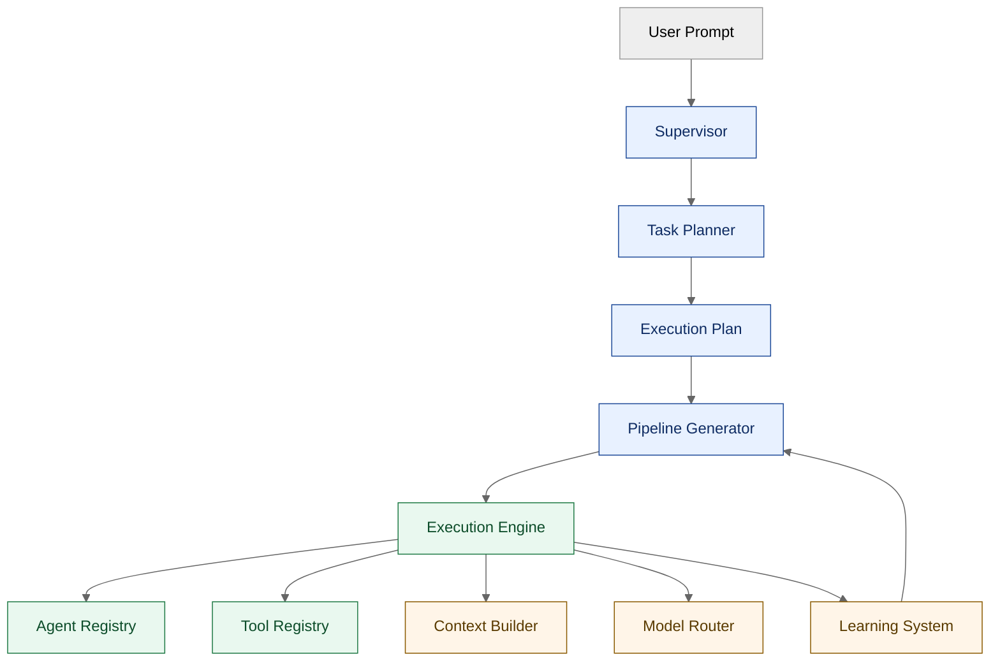

<div align="center">

<h1>🛡️ Sentinel</h1>
<p><strong>Local Autonomous Development Assistant</strong></p>
<p>Powered entirely by <a href="https://ollama.ai">Ollama</a> — no cloud, no API keys, no data sent off your machine.</p>


</div>

---

## What is Sentinel?

Sentinel is a fully local, autonomous AI coding assistant that runs on your own hardware using [Ollama](https://ollama.ai) language models. It understands natural-language development tasks, decomposes them into structured pipelines, routes each step to the appropriate specialist agent, and executes them using a rich toolkit — all without sending a single byte to an external service.

**Key properties:**
- **100% local** — all inference runs on your machine via Ollama
- **Hardware-aware** — automatically selects models and parallelism for your CPU/GPU
- **Self-improving** — tracks performance metrics and adapts pipeline strategies over time
- **Session-persistent** — save and resume work across multiple conversations
- **Extensible** — add new agents, tools, or models without touching core logic

---

## Architecture Summary



See [ARCHITECTURE.md](ARCHITECTURE.md) for a detailed breakdown of every subsystem.

---

## Hardware Requirements

| Mode | RAM | GPU VRAM | Coding Model | Reasoning Model | Concurrency |
|---|---|---|---|---|---|
| **Minimal** | 8–12 GB | None required | `codellama:7b` | `mistral:7b` | 1 (sequential) |
| **Standard** | 12–20 GB | < 6 GB or none | `codellama:13b` | `mixtral:8x7b` | 2 |
| **Advanced** | ≥ 20 GB or GPU ≥ 6 GB VRAM | Optional | `codellama:34b` | `mixtral:8x7b` | 4 |

Sentinel automatically detects your hardware and selects the appropriate mode. You can override with `--mode`.

**Embedding model** (all modes): `nomic-embed-text`

---

## Supported Models

Any Ollama-compatible model can be used. The recommended defaults per mode:

| Purpose | Minimal | Standard | Advanced |
|---|---|---|---|
| Code generation | `codellama:7b` | `codellama:13b` | `codellama:34b` |
| Reasoning / planning | `mistral:7b` | `mixtral:8x7b` | `mixtral:8x7b` |
| Embeddings | `nomic-embed-text` | `nomic-embed-text` | `nomic-embed-text` |

Alternatives that work well: `deepseek-coder`, `qwen2.5-coder`, `llama3`, `phi3`, `gemma2`.

---

## Installation

### Prerequisites

- Python 3.11 or later
- [Ollama](https://ollama.ai/download) installed and running
- Git (optional, for git-related tools)

### Quick install

```bash
# 1. Clone the repository
git clone https://github.com/Aritra-Chats/Local-LLM-Coding-Assistant.git
cd Local-LLM-Coding-Assistant

# 2. Create and activate a virtual environment
python -m venv .venv

# Windows
.venv\Scripts\activate

# Linux / macOS
source .venv/bin/activate

# 3. Install dependencies
pip install -r requirements.txt

# 4. Start Sentinel (bootstraps automatically on first run)
python main.py
```

On first launch, Sentinel will:
1. Detect your hardware and select an appropriate mode
2. Install any missing Python packages
3. Pull the required Ollama models (this may take several minutes)
4. Create workspace directories under `~/.sentinel/`

See [INSTALLATION.md](INSTALLATION.md) for detailed setup instructions including offline installation and troubleshooting.

---

## CLI Examples

```bash
# Start a new session
python main.py

# Resume a previous session
python main.py --resume 5f63c8db-7f49-4fa4-a42f-6d53ec2d4b5f

# Target a specific project directory
python main.py --project C:\code\my-api

# Force a hardware mode
python main.py --mode minimal

# Skip the bootstrap check (faster startup after first run)
python main.py --no-bootstrap

# Windows launcher
sentinel.bat
sentinel.bat --resume 5f63c8db-7f49-4fa4-a42f-6d53ec2d4b5f
```

### Slash commands inside the REPL

| Command | Description |
|---|---|
| `/help` | List all available commands |
| `/status` | Show current session and system status |
| `/pipeline` | Show the current pipeline as a table |
| `/models` | List available local Ollama models |
| `/session` | Display current session info |
| `/resume <id>` | Load a previous session |
| `/context` | Show what the context engine has assembled |
| `/index` | Rebuild the current project index |
| `/syscheck` | Run hardware and dependency checks |
| `/tasks` | List user tasks in the current session |
| `/mode <mode>` | Switch hardware mode for the current session |
| `/diff` | Show the diff of the last file edit |
| `/clear` | Clear the terminal |
| `/exit` | Save session and exit |

### Example task prompts

```
sentinel › Write a FastAPI endpoint that validates a JWT and returns the user profile
sentinel › Debug the failing tests in tests/test_auth.py
sentinel › Refactor src/database.py to use async SQLAlchemy
sentinel › Add GitHub Actions CI for a Python project
sentinel › Explain the dependency graph of this project
```

---

## Project Structure

```
local-llm-assistant/
├── agents/          Supervisor, planner, pipeline generator + 6 specialist agents
├── cli/             Interactive REPL, display helpers, diff viewer, command palette
├── config/          Hardware profile, model catalogue, runtime settings
├── context/         RAG search, symbol graph, dependency graph, attachment loader
├── core/            Bootstrap, execution engine, model router, validator
├── execution/       Dynamic pipeline generation, step runner, retry, sandbox
├── learning/        Metrics tracker, pipeline optimiser, prompt A/B engine
├── memory/          Session store, conversation memory, project index
├── models/          Ollama client, embedding client, model registry
├── system/          Hardware detector, dependency installer, Ollama manager
├── tasks/           Task planner, classifier, schema definitions
├── tools/           12 built-in tools: read/write, search, shell, git, web, …
├── tests/           Test suite skeleton
├── main.py          Entry point & runtime orchestrator
├── sentinel.bat     Windows launcher
├── pyproject.toml
└── requirements.txt
```

---

## Documentation

| Document | Description |
|---|---|
| [ARCHITECTURE.md](ARCHITECTURE.md) | Deep-dive into every subsystem |
| [INSTALLATION.md](INSTALLATION.md) | Detailed setup, offline install, troubleshooting |
| [USAGE.md](USAGE.md) | Complete CLI reference and workflow guide |
| [CONTRIBUTING.md](CONTRIBUTING.md) | How to contribute code, tests, and documentation |
| [ROADMAP.md](ROADMAP.md) | Planned features and release milestones |
| [SECURITY.md](SECURITY.md) | Security policy and vulnerability reporting |
| [CODE_OF_CONDUCT.md](CODE_OF_CONDUCT.md) | Community standards |

---

## License

MIT License — see [LICENSE](LICENSE) for full text.
