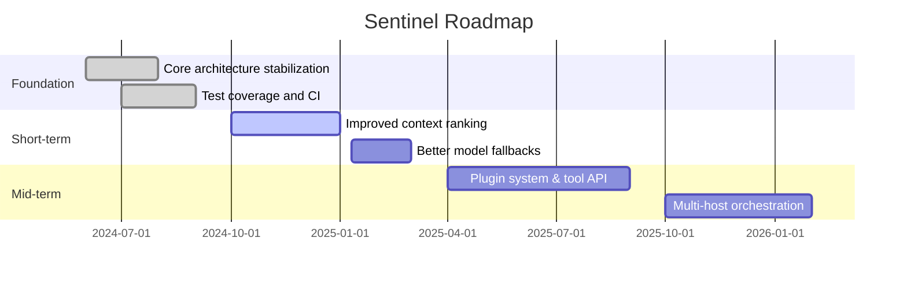

# Project Roadmap

This roadmap outlines the planned milestones, short-term and long-term objectives, and expected timelines. It is a living document and will be updated as priorities evolve.

## Themes

- Reliability & safety
- Performance & model routing
- Developer ergonomics
- Extensibility & plugin model

## Interactive view

Expand items for details and owner notes.

High-level milestones (Gantt)

## How to influence the roadmap

Open issues tagged `roadmap` and join architecture discussions on PRs. Major feature proposals should include a migration plan and backwards-compatibility notes.
