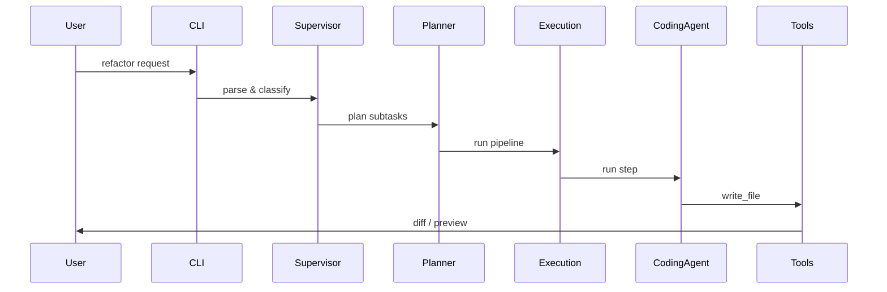

# Usage Guide

This document describes interactive and programmatic usage patterns for Sentinel, including example flows, pipelines, and troubleshooting tips for common workflows.

## Table of contents

- [Typical workflows](#typical-workflows)
- [CLI flags and examples](#cli-flags-and-examples)
- [Programmatic API](#programmatic-api)
- [Best practices](#best-practices)

## Typical workflows

### 1) Ask for a code change

```text
> refactor: extract function compute_stats from data/process.py
```

Example flow (expand for details):

<details>
<summary>Show flowchart</summary>



</details>

### 2) Reproduce and fix a failing test

Send the failing test output and ask Sentinel to reproduce locally. The `DebuggingAgent` will attempt to run tests, capture logs, and propose patches.

## CLI flags and examples

- `--project <path>` — point to the repository to operate on
- `--hw-mode {minimal,standard,advanced}` — force a hardware profile
- `--no-bootstrap` — skip bootstrap checks
- `--dry-run` — simulate file edits without writing

Example:

```bash
sentinel --project /path/to/repo --hw-mode standard --dry-run
```

## Programmatic API

Some core components expose programmatic APIs (importable modules), for example `execution.pipeline` and `core.execution_engine`. The APIs are primarily intended for advanced integrations, tests, and automation.

Example (pseudo-code) — run a pipeline programmatically (dry-run):

```python
from execution.pipeline import Pipeline
from core.execution_engine import ConcreteExecutionEngine

# load or construct a Pipeline object (from an ExecutionPlan)
pipeline = Pipeline.from_json(plan_json)

engine = ConcreteExecutionEngine(hw_profile="standard")
result = engine.run_pipeline(pipeline, dry_run=True)
print(result.summary())
```

Notes:
- `Pipeline.from_json` is a convenience; see `execution/pipeline.py` for the exact constructor signature used in this codebase.
- Use `dry_run=True` to preview file edits and tool calls without applying side-effects.

### Previewing diffs (safe workflow)

Always preview changes before applying them to a repository:

```bash
sentinel --project /path/to/repo --dry-run
# or programmatically: engine.run_pipeline(pipeline, dry_run=True)
```

The `dry-run` output includes a structured diff summary; use it to review and run tests locally before accepting changes.

## Best practices

- Use `--dry-run` for high-impact changes to review diffs first.
- Limit broad refactors to small batches and run full test suites afterwards.
- Add unit tests and update existing tests when editing behavior.

---

For more complex examples, see the `examples/` folder (if present) or ask Sentinel interactively.
